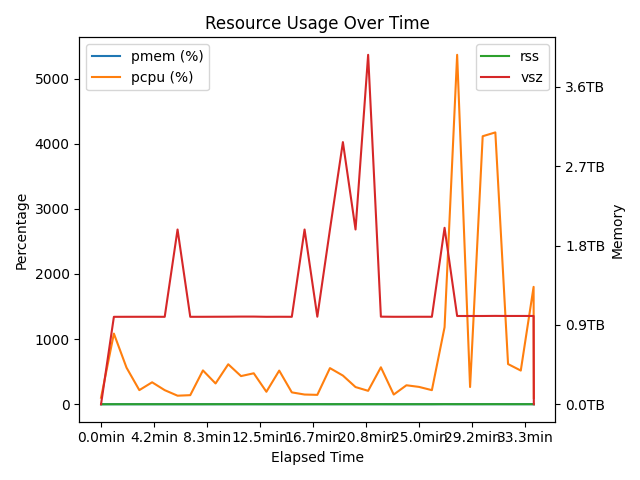
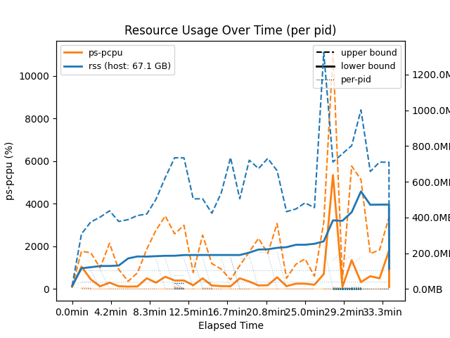
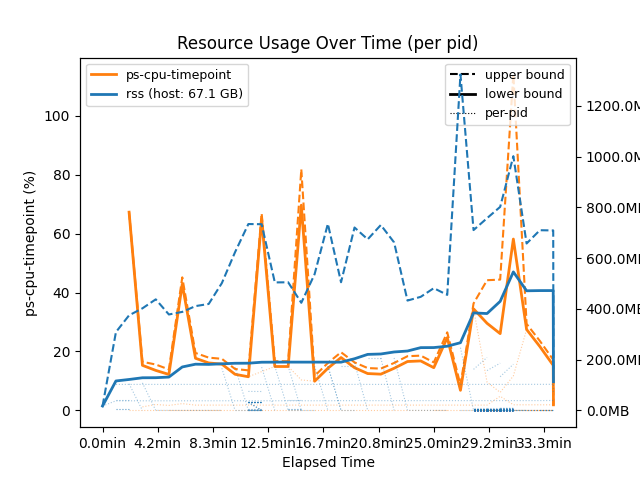
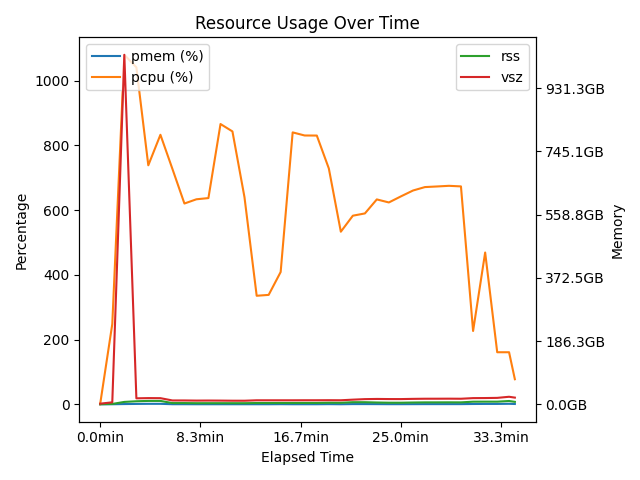
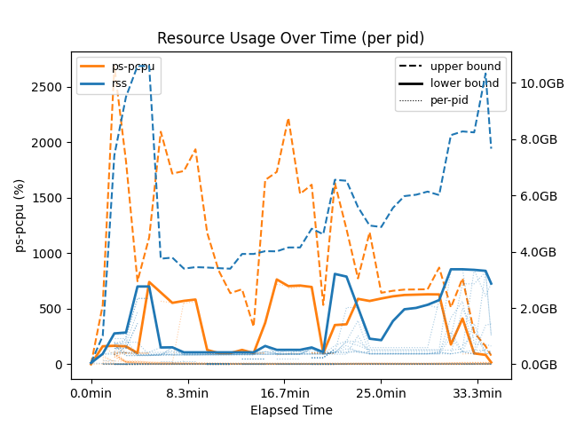
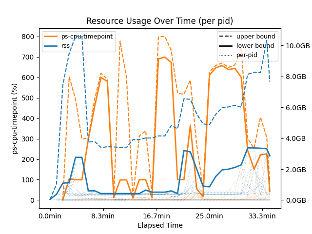

# Temporary plot demo for #399 — REVERT BEFORE MERGE

This commit (`REVERT ME: TEMPORARY DEMO`) is on the draft PR only so
reviewers can compare the new plot output against real data without
hunting for log files. The actual PR content is the previous commit
(`plot: render per-pid pdcpu/pmem/rss instead of summed totals`).
This commit will be dropped via `git reset --hard HEAD~1` (or
equivalent) before the PR is marked ready.

## Reproduce

Install the branch and run on the bundled logs in each mode:

```sh
pip install -e '.[all]'
con-duct plot tmp-logs/399-usage.json --cpu ps-pcpu          --output 399-pspcpu.png
con-duct plot tmp-logs/399-usage.json --cpu ps-cpu-timepoint --output 399-timepoint.png
con-duct plot tmp-logs/fmriprep_sub-CC0007_usage.jsonl --cpu ps-pcpu          --output fmriprep-pspcpu.png
con-duct plot tmp-logs/fmriprep_sub-CC0007_usage.jsonl --cpu ps-cpu-timepoint --output fmriprep-timepoint.png
```

The pre-rendered "main" images were produced by the old `plot.py`
on `main` against the same logs.

## #399 (datalad/tox, 2853 unique pids)

Old `con-duct plot` (column 1) summed `totals.pcpu` / `totals.rss`,
producing the 5363% peak that started this issue. Per-pid traces in
both modes (columns 2 and 3) eliminate the bogus aggregation; the
new default `--cpu ps-pcpu` plots ps's raw lifetime ratio
untransformed, while `--cpu ps-cpu-timepoint` opts into our
delta-corrected estimate.

| main | --cpu ps-pcpu (new default) | --cpu ps-cpu-timepoint |
|---|---|---|
|  |  |  |

## fmriprep on SLURM (`ds003798` sub-CC0007, 324 unique pids)

Same story on a real fmriprep run.

| main | --cpu ps-pcpu (new default) | --cpu ps-cpu-timepoint |
|---|---|---|
|  |  |  |

## Sources

- `tmp-logs/399-usage.json` — 36-record duct log from con/duct#399.
- `tmp-logs/fmriprep_sub-CC0007_usage.jsonl` — one fmriprep subject
  (`ds003798`) recorded on a SLURM cluster.
